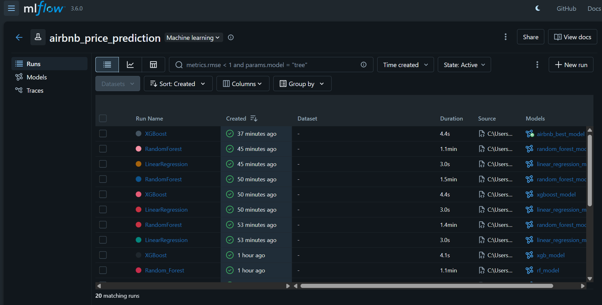
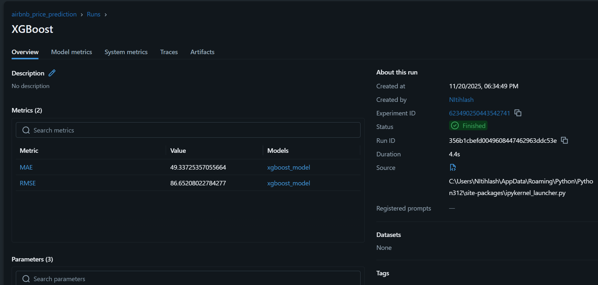
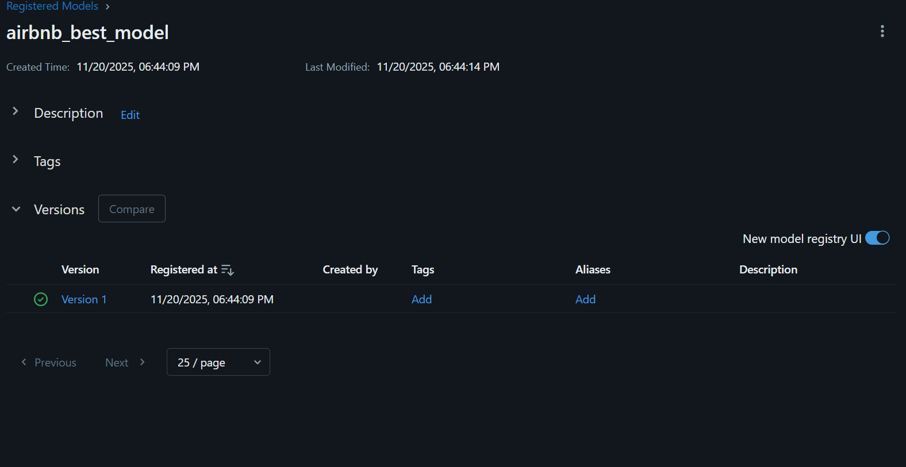

# StayWise – Airbnb Nightly Price Prediction Using AWS S3 + MLflow  
### Author: Nithilash Vivekanandan  

---

##  **Project Overview**
 
The company wants to enhance its **dynamic nightly pricing system**, helping hosts set competitive and optimized prices.

StayWise stores all raw listing data in **AWS S3**, and the Data Science workflow uses **MLflow** for:

- Tracking experiments  
- Logging metrics & parameters  
- Managing models  
- Registering the best performing model  

This project demonstrates the full pipeline:

1. Retrieving raw Airbnb data from **AWS S3**  
2. Cleaning & preprocessing the dataset  
3. Building and comparing multiple ML models  
4. Tracking experiments with **MLflow**  
5. Registering the best model for deployment  

---

## **Repository Structure**

StayWise-Airbnb-Price-Prediction
│
├── Notebooks/
│   ├── 01_data_access.ipynb           # Loads raw data from AWS S3
│   ├── 02_preprocessing.ipynb         # Data cleaning & preprocessing
│   └── 03_modeling_mlflow.ipynb       # Modeling + MLflow experiment tracking
│
├── Images/
│   ├── mlflow_runs.png                # Screenshot of experiment runs
│   ├── mlflow_best_model.png          # Screenshot of MAE/RMSE (best model)
│   └── mlflow_registered_model.png    # Screenshot of registered best model
│
├── README.md                          # Full project documentation
├── requirements.txt                   # Python dependencies
└── .gitignore                         # Prevents large/unnecessary files from being committed


##  **Setup & Execution Instructions**

###  Clone the Repository
```bash
git clone https://github.com/USERNAME/StayWise-Airbnb-MLflow.git
cd StayWise-Airbnb-MLflow
pip install -r requirements.txt
aws configure
jupyter notebook
mlflow ui
```

## MLflow Screenshots

### MLflow – Experiment Runs


### MLflow – Best Model Metrics


### MLflow – Registered Model in Model Registry



